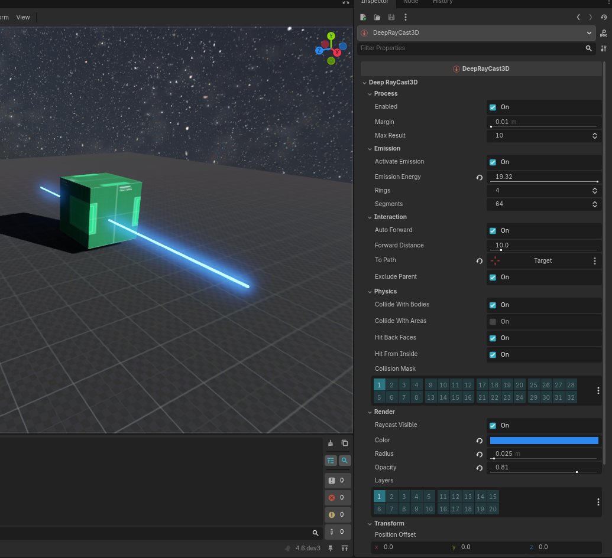
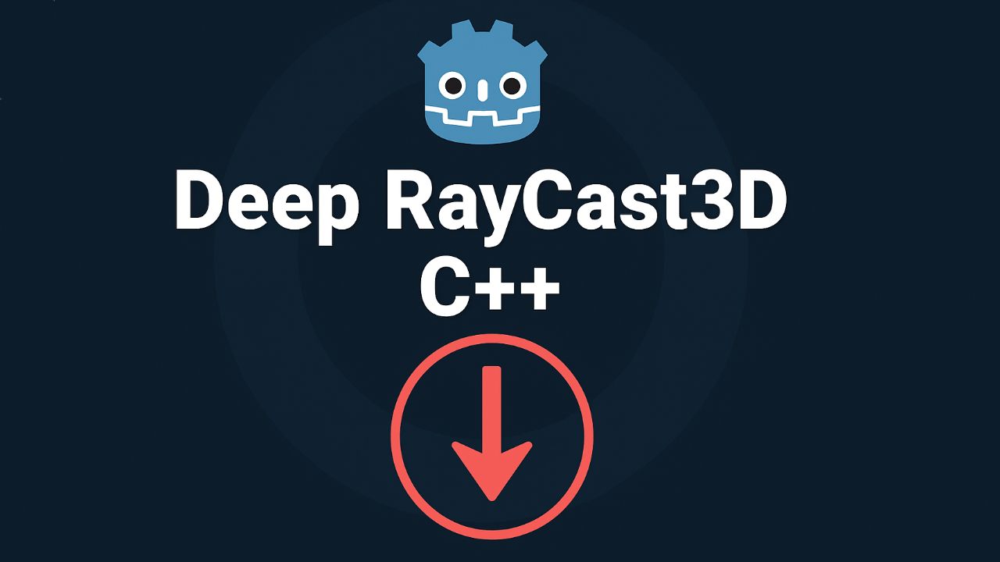

# Deep RayCast3D C++

## Overview

**DeepRayCast3D** is a custom Godot **GDExtension plugin** that enhances the functionality of the built-in `RayCast3D`.  
Unlike the default node, this extension allows **multiple consecutive collision detections** along a single ray beam, making it ideal for complex scanning, sensors, weapons, or physics analysis.

It also includes a **fully customizable visible beam renderer**, enabling visual debugging and in-game effects.

If you prefer using gdscript, the same plugin can be found here: https://github.com/Saulo-de-Souza/DeepRayCast3D

---

## Features

- Detect **multiple colliders** along a single ray.
- Works with both `PhysicsBody3D` and `Area3D`.
- Configurable detection distance, margin, and collision mask.
- Optional **visible beam** with customizable color, opacity, emission, and geometry.
- Supports automatic forward projection or manual targeting using `to_path`.
- Emits a signal when collisions are detected with detailed hit information.

---

## Installation

> If you use Windows as your operating system, you can copy the addons folder to your game project.
If you use another operating system and want to export to other systems, download the project and compile it according to the operating system.

**Windows**:
```sh
set PATH=%PATH%;C:\directory\your\scons\
scons platform=windows arch=x86_64 target=template_debug
scons platform=windows arch=x86_32 target=template_debug
scons platform=windows arch=x86_64 target=template_release
scons platform=windows arch=x86_32 target=template_release
```

**Web**:
```sh
set PATH=%PATH%;C:\directory\your\scons\
emsdk\emsdk_env.bat
scons platform=web target=template_debug dlink_enabled=yes threads=no
scons platform=web target=template_release dlink_enabled=yes threads=no
```

**Linux**:
```sh
set PATH=%PATH%;C:\directory\your\scons\
scons platform=linux arch=x86_64 target=template_debug
scons platform=linux arch=x86_64 target=template_release
scons platform=linux arch=arm64 target=template_debug
scons platform=linux arch=arm64 target=template_release
```

**MacOS**:
```sh
set PATH=%PATH%;C:\directory\your\scons\
scons platform=macos arch=x86_64 target=template_debug
scons platform=macos arch=x86_64 target=template_release
```

**Android**:
```sh
set PATH=%PATH%;C:\directory\your\scons\
scons platform=android arch=arm64v8 target=template_debug
scons platform=android arch=arm64v8 target=template_release
scons platform=android arch=arm32v7 target=template_debug
scons platform=android arch=arm32v7 target=template_release
```

**IOS**:
```sh
set PATH=%PATH%;C:\directory\your\scons\
scons platform=ios arch=universal target=template_debug
scons platform=ios arch=universal target=template_release
```

>Once compiled, simply copy the addons folder to your project in Godot Engine and restart the project to reload.

> **Note:** When exporting your game, ensure that the option **“Extension Support”** is enabled in the export settings.

---

## Node Overview

### `DeepRayCast3D`

An advanced raycasting node with multiple collision checks per beam.

### `DeepRayCast3DResult`

Holds information about a single hit detected by `DeepRayCast3D`.

---

## Example — Iterating Colliders in `_physics_process`

```gdscript
@onready var deep_ray = $DeepRayCast3D

func _physics_process(_delta):
    # Perform multi-hit detection
    for i in range(deep_ray.get_collider_count()):
        var collider = deep_ray.get_collider(i)
        var position = deep_ray.get_position(i)
        var normal = deep_ray.get_normal(i)
        print("Hit:", collider, "at", position, "normal:", normal)
```

---

## Example — Using Signals

```gdscript
func _ready():
    var deep_ray = DeepRayCast3D.new()
    deep_ray.enabled = true
    deep_ray.forward_distance = 20.0
    deep_ray.max_result = 5
    deep_ray.collide_with_bodies = true
    deep_ray.collide_with_areas = false
    add_child(deep_ray)

    deep_ray.cast_collider.connect(_on_ray_hits)

func _on_ray_hits(results):
    for result in results:
        print("Detected:", result.get_collider(), "at", result.get_position())
```

---

## Key Properties

| Property              | Type       | Default             | Description                                                                                                       |
| --------------------- | ---------- | ------------------- | ----------------------------------------------------------------------------------------------------------------- |
| `activate_emission`   | `bool`     | `true`              | Enables emission lighting on the beam using the configured `color`. When disabled, the beam is rendered as unlit. |
| `auto_forward`        | `bool`     | `true`              | Automatically casts along the parent’s -Z axis. When disabled, the beam follows the target defined in `to_path`.  |
| `collide_with_areas`  | `bool`     | `false`             | Enables detection of `Area3D` nodes.                                                                              |
| `collide_with_bodies` | `bool`     | `true`              | Enables detection of `PhysicsBody3D` nodes.                                                                       |
| `collision_mask`      | `int`      | `1`                 | Physics collision mask determining which layers the ray interacts with.                                           |
| `color`               | `Color`    | `Color(1, 0, 0, 1)` | Base color of the visible beam and its emission.                                                                  |
| `emission_energy`     | `float`    | `10.0`              | Controls the intensity of the beam’s emission when `activate_emission` is true.                                   |
| `enabled`             | `bool`     | `true`              | Enables or disables the raycast. When false, no collision checks are performed.                                   |
| `exclude_parent`      | `bool`     | `true`              | Automatically excludes the parent node from collisions to prevent self-hits.                                      |
| `forward_distance`    | `float`    | `10.0`              | Maximum beam distance when `auto_forward` is enabled.                                                             |
| `hit_back_faces`      | `bool`     | `true`              | Determines whether back faces of surfaces can be hit by the ray.                                                  |
| `hit_from_inside`     | `bool`     | `true`              | Allows detection even if the ray starts inside a collider.                                                        |
| `layers`              | `int`      | `1`                 | Rendering layer mask for the visible beam (does not affect physics).                                              |
| `margin`              | `float`    | `0.01`              | Small offset applied after each hit to avoid detecting the same collider repeatedly.                              |
| `max_result`          | `int`      | `10`                | Maximum number of consecutive collisions detected per cast.                                                       |
| `opacity`             | `float`    | `0.7`               | Transparency level of the beam (0 = invisible, 1 = opaque).                                                       |
| `position_offset`     | `Vector3`  | `Vector3(0, 0, 0)`  | Offset applied to the beam’s origin relative to its parent node.                                                  |
| `radius`              | `float`    | `0.02`              | Radius of the beam’s cylindrical mesh.                                                                            |
| `raycast_visible`     | `bool`     | `true`              | Makes the beam visible in the viewport; disable for logic-only usage.                                             |
| `rings`               | `int`      | `4`                 | Number of vertical ring divisions in the beam’s cylinder.                                                         |
| `segments`            | `int`      | `64`                | Number of radial subdivisions (sides) in the beam’s cylinder mesh.                                                |
| `to_path`             | `NodePath` | `""`                | Target node path used when `auto_forward` is disabled. The beam is cast toward this node.                         |

---

## Methods

| Method                  | Return Type     | Parameters             | Description                                                                                                                                                    |
| ----------------------- | --------------- | ---------------------- | -------------------------------------------------------------------------------------------------------------------------------------------------------------- |
| `add_exclude(value)`    | `void`          | `value: PhysicsBody3D` | Adds a physics body to the exclusion list. Bodies in this list are ignored during raycast checks. Useful for preventing the ray from hitting its own emitter.  |
| `clear_exclude()`       | `void`          | —                      | Clears the exclusion list, allowing all bodies to be detected again.                                                                                           |
| `get_collider(value)`   | `PhysicsBody3D` | `value: int`           | Returns the physics body corresponding to the given hit index from the last deep raycast result. The index must be between `0` and `get_collider_count() - 1`. |
| `get_collider_count()`  | `int`           | —                      | Returns the number of colliders detected in the last deep raycast execution.                                                                                   |
| `get_normal(value)`     | `Vector3`       | `value: int`           | Returns the surface normal vector of the collision at the given hit index. This vector represents the perpendicular direction to the impacted surface.         |
| `get_position(value)`   | `Vector3`       | `value: int`           | Returns the global position of the collision point for the specified hit index.                                                                                |
| `remove_exclude(value)` | `void`          | `value: PhysicsBody3D` | Removes a specific body from the exclusion list, allowing it to be detected again.                                                                             |

---

## Result Object (`DeepRayCast3DResult`)

| Method             | Description                              |
| ------------------ | ---------------------------------------- |
| `get_collider()`   | Returns the collider object.             |
| `get_position()`   | Returns the hit position in world space. |
| `get_normal()`     | Returns the hit surface normal.          |
| `get_face_index()` | Returns the mesh face index hit.         |
| `get_rid()`        | Returns the RID of the hit object.       |
| `get_shape()`      | Returns the shape index of the hit.      |

---

## Screenshots

**Screenshot InputManager**




